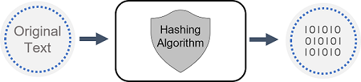

# Microsoft Security, Compliance, and Identity Fundamentals: Describe the concepts of security, compliance, and identity

## Introduction [Module -1]

As more business data is being accessed from locations outside of the traditional corporate network, security and compliance have become overriding concerns. Organizations need to understand how they can best protect their data, regardless of where it's accessed from, and whether it sits on their corporate network or in the cloud. In addition, organizations need to ensure they're compliant with industry and regulatory requirements to ensure the protection and privacy of data.

This module introduces some important security and compliance concepts. You'll learn about the shared responsibility model, defense in depth, and Zero Trust model. You'll be introduced to the concepts of encryption and hashing as ways to protect data. Lastly, you'll learn about concepts that relate to compliance.

After completing this module, you'll be able to:

Describe the shared responsibility and the defense in-depth security models.
Describe the Zero-Trust model.
Describe the concepts of encryption and hashing.
Describe some basic compliance concepts.

## Shared Responsibility Model in Cloud Computing

The **Shared Responsibility Model** is a security framework in cloud computing that defines specific security roles for both the cloud provider (like Microsoft Azure) and the customer. It helps both parties understand their security responsibilities across different cloud service models (IaaS, PaaS, SaaS), leading to safer and more efficient cloud usage.

---

### 1. **Service Model Influence**

The shared responsibility shifts depending on the cloud service model:

- **Infrastructure as a Service (IaaS)**:

  - **Definition**: Provides virtualized computing resources (like virtual machines and storage).
  - **Customer Responsibilities**: Secures applications, data, operating systems, and network configurations.
  - **Example**: In an IaaS model, a company using a virtual machine on Azure must handle OS patches, install firewalls, and manage network settings.

- **Platform as a Service (PaaS)**:

  - **Definition**: Provides a platform that includes managed services (like databases).
  - **Customer Responsibilities**: Manages application security and data, while the provider secures underlying OS and runtime.
  - **Example**: A development team using Azure App Services focuses on securing their code and data; Azure manages server maintenance and OS updates.

- **Software as a Service (SaaS)**:
  - **Definition**: Offers fully managed applications (e.g., Microsoft 365).
  - **Customer Responsibilities**: Limited to managing user access, data usage, and specific settings.
  - **Example**: With Microsoft 365, Microsoft secures the entire application and infrastructure. The customer sets access permissions and user policies.

---

### 2. **Responsibilities of the Cloud Provider**

The cloud provider, such as Microsoft Azure, takes on several core security responsibilities:

- **Physical Security**:

  - The provider maintains the security of data centers through restricted access, surveillance, backup power, and environmental controls.
  - **Example**: Azure data centers have secure perimeters, surveillance, and controlled access to prevent unauthorized physical access.

- **Network Controls**:

  - Providers secure their networks with defenses like firewalls, network monitoring, and Distributed Denial of Service (DDoS) protection.
  - **Example**: Microsoft Azure has built-in DDoS protection services that detect and block malicious traffic before it reaches customers’ resources.

- **Hardware and Software Maintenance**:

  - Ensures that core hardware and software layers, like virtualization and networking, are regularly patched and updated.
  - **Example**: Azure automatically updates hypervisors and virtual machine hosts to protect against vulnerabilities, so customers don't have to.

- **Availability and Resilience**:

  - Providers guarantee high uptime and disaster recovery with service-level agreements (SLAs).
  - **Example**: Azure offers an SLA of up to 99.9% availability, with backup options for data recovery.

- **Compliance Management**:
  - Providers align with regulations (like GDPR, HIPAA) to support customer compliance needs.
  - **Example**: Microsoft Azure is compliant with GDPR and HIPAA, simplifying the regulatory burden for customers in sensitive industries.

---

### 3. **Responsibilities of the Customer**

Customers are responsible for configuring and managing certain aspects to ensure their data and applications are secure:

- **Data Protection**:

  - Customers must manage encryption, access controls, and backups for data integrity and confidentiality.
  - **Example**: A financial firm encrypts customer data stored in Azure and schedules regular backups to mitigate data loss risks.

- **Identity and Access Management**:

  - Securing access with strong authentication, role-based access controls (RBAC), and user permissions.
  - **Example**: A company uses Azure Active Directory (AAD) to enforce multi-factor authentication and restricts access based on roles.

- **Application and Operating System Security**:

  - In IaaS, customers must patch the OS, secure application configurations, and scan for vulnerabilities.
  - **Example**: For a virtual machine running a website, a customer must ensure both the OS and web application are patched and secure.

- **Endpoint Protection**:

  - Customers need to secure user devices accessing cloud applications, using endpoint protection software.
  - **Example**: A business installs antivirus and monitoring software on all employee devices accessing Azure applications to prevent breaches.

- **Compliance Responsibilities**:
  - Customers are responsible for configuring their systems to meet regulatory requirements.
  - **Example**: A healthcare provider using Azure must configure their data handling and reporting to meet HIPAA requirements.

---

### 4. **Security in Different Cloud Models**

Each cloud service model has its own level of responsibility:

- **Shared Responsibility in IaaS**:

  - Most security responsibilities are with the customer, from securing data and OS to managing configurations.
  - **Example**: A business using Azure Virtual Machines must handle everything above the hypervisor, including OS patches and firewall settings.

- **Shared Responsibility in PaaS**:

  - The provider manages the environment, and customers focus on their application security, data handling, and configurations.
  - **Example**: With Azure SQL Database, Microsoft manages the database platform, while customers handle SQL queries and data encryption.

- **Shared Responsibility in SaaS**:
  - The provider covers most layers, and customers focus on access management and user policies.
  - **Example**: In Microsoft 365, Microsoft secures the application, and customers set user permissions and monitor usage.

---

### 5. **Benefits of the Shared Responsibility Model**

- **Enhanced Security**: Dividing responsibilities enables each party to focus on specific security layers, minimizing vulnerabilities.
- **Cost-Effectiveness**: Reduces customer expenses by outsourcing physical and network security to the provider.
- **Adaptability**: Flexible to service models, customer requirements, and organizational goals.
- **Clarity in Compliance and Accountability**: Clearly defines security boundaries, simplifying compliance, especially for regulated industries.

---

The Shared Responsibility Model provides a strong security foundation for cloud environments. It clarifies accountability, enabling customers and providers to create a secure, efficient cloud environment.

This summary highlights core concepts and responsibilities to help ensure your notes reflect the security expectations in cloud computing.

[Official docs](https://learn.microsoft.com/en-us/training/modules/describe-security-concepts-methodologies/2-describe-shared-responsibility-model)

## Defense in Depth: Comprehensive Cloud Security Approach

**Defense in Depth** is a cybersecurity strategy that layers multiple security measures to protect data, applications, and infrastructure. The idea is to build multiple security layers so that if one defense fails, others remain active, creating a comprehensive and resilient security posture. It’s based on the concept of redundancy in security: using varied, overlapping defenses minimizes risks and provides depth to security, preventing breaches even if an attacker penetrates one layer.

---

### Core Layers of Defense in Depth

Microsoft outlines **seven key layers** in defense in depth, each addressing a specific part of a system to enhance security:

1. **Physical Security**

   - **Objective**: Protects data centers and physical infrastructure against unauthorized physical access.
   - **Measures**: Surveillance, access controls, security guards, and environmental systems (fire suppression, cooling).
   - **Example**: Microsoft Azure data centers use biometric scanning, 24/7 surveillance, and limited access to authorized personnel only, ensuring unauthorized individuals cannot physically access servers or storage.

2. **Identity and Access Control**

   - **Objective**: Ensures that only authorized users access systems and data, guarding against unauthorized access and insider threats.
   - **Measures**: Strong authentication (multi-factor authentication), role-based access control (RBAC), conditional access policies.
   - **Example**: Using Azure Active Directory (AAD), a company enforces multi-factor authentication (MFA) for all employees. Employees accessing sensitive data must verify their identity with an MFA code in addition to their password.

3. **Perimeter Security**

   - **Objective**: Creates a security boundary to prevent unauthorized network access, keeping potential attackers out.
   - **Measures**: Firewalls, Distributed Denial of Service (DDoS) protection, virtual private networks (VPNs).
   - **Example**: Microsoft Azure provides DDoS protection to detect and block malicious traffic before it can reach a company's resources. This perimeter protection prevents DDoS attacks that could disrupt services.

4. **Network Security**

   - **Objective**: Protects network communication within the cloud environment to prevent internal threats and contain potential breaches.
   - **Measures**: Network segmentation, virtual network firewalls, network security groups (NSGs).
   - **Example**: A company segments its network into zones based on sensitivity. For instance, database servers reside on one virtual network (VNet) and are only accessible by specific application servers, reducing the chance of lateral movement by attackers.

5. **Compute Security**

   - **Objective**: Secures VMs, containers, and compute resources by ensuring these environments are regularly patched, configured securely, and monitored.
   - **Measures**: Anti-malware, endpoint protection, vulnerability assessments, and system hardening.
   - **Example**: Azure Security Center can run vulnerability scans on VMs, providing a list of recommended security updates and helping the company quickly patch vulnerabilities to maintain secure compute environments.

6. **Application Security**

   - **Objective**: Protects applications from vulnerabilities and ensures they are securely coded and managed.
   - **Measures**: Secure application development practices, code analysis, runtime application self-protection (RASP), web application firewalls (WAF).
   - **Example**: A development team uses Azure Application Gateway’s Web Application Firewall to protect an e-commerce website against common attacks like SQL injection and cross-site scripting, blocking malicious requests at the application level.

7. **Data Security**
   - **Objective**: Ensures that data is securely stored, accessed, and managed.
   - **Measures**: Data encryption (at rest and in transit), data masking, access controls, and data loss prevention (DLP).
   - **Example**: A healthcare company stores patient data in Azure SQL Database, with encryption enabled for data at rest and in transit. Role-based access ensures only medical staff can view patient information, adding extra data security measures to comply with healthcare regulations.

---

### Benefits of Defense in Depth

1. **Comprehensive Security Coverage**: Protects every part of the cloud environment, from physical security at data centers to data encryption.
2. **Redundant Protections**: If one layer is breached, others remain active, minimizing overall risk.
3. **Tailored Security**: Allows organizations to apply relevant protections based on their unique needs and regulatory requirements.

---

### Example of Defense in Depth in Practice

Imagine a company storing confidential data on Azure. Here’s how Defense in Depth would work:

- **Physical Security**: Azure’s data center enforces biometric security, ensuring only specific personnel access server rooms.
- **Identity and Access**: Employees use multi-factor authentication and are assigned roles in Azure Active Directory, restricting access based on job responsibilities.
- **Perimeter Security**: Azure’s DDoS protection blocks unusual traffic patterns, preventing external DDoS attacks.
- **Network Security**: Network security groups limit access, only allowing essential communication between application and database servers.
- **Compute Security**: Azure Security Center regularly scans the company’s VMs, notifying IT of any necessary patches.
- **Application Security**: The application development team uses secure coding practices, preventing vulnerabilities like SQL injections.
- **Data Security**: Data at rest in Azure Storage is encrypted, and data in transit is protected with SSL/TLS, ensuring no unauthorized access.

Each layer adds redundancy, making it harder for potential attackers to breach the system, enhancing overall security.

### Confidentiality, Integrity, Availability (CIA)

As described above, a defense in-depth strategy uses a series of mechanisms to slow the advance of an attack. All the different mechanisms (technologies, processes, and training) are elements of a cybersecurity strategy, whose goals include ensuring confidentiality, integrity, and availability; often referred to as CIA.

**Confidentiality** refers to the need to keep confidential sensitive data such as customer information, passwords, or financial data. You can encrypt data to keep it confidential, but then you also need to keep the encryption keys confidential. Confidentiality is the most visible part of security; we can clearly see need for sensitive data, keys, passwords, and other secrets to be kept confidential.

**Integrity** refers to keeping data or messages correct. When you send an email message, you want to be sure that the message received is the same as the message you sent. When you store data in a database, you want to be sure that the data you retrieve is the same as the data you stored. Encrypting data keeps it confidential, but you must then be able to decrypt it so that it's the same as before it was encrypted. Integrity is about having confidence that data hasn't been tampered with or altered.

**Availability** refers to making data available to those who need it, when they need it. It's important to the organization to keep customer data secure, but at the same time it must also be available to employees who deal with customers. While it might be more secure to store the data in an encrypted format, employees need access to decrypted data.

While the goals of a cybersecurity strategy are to preserve the confidentiality, integrity, and availability of systems, networks, applications, and data; it's the goal of cybercriminals to disrupt these goals. Microsoft’s portfolio includes the solutions and technologies to enable organizations to deliver on the goals of the CIA triad.

### Learn More

[Defense in Depth ](https://learn.microsoft.com/en-us/training/modules/describe-security-concepts-methodologies/3-describe-defense-depth).

## Zero Trust Model: A Modern Security Framework

The **Zero Trust Model** is a security framework that assumes no user, device, or system—whether inside or outside an organization's network—can automatically be trusted. Unlike traditional network security approaches that trust devices within a network perimeter, Zero Trust continuously verifies every access request, securing resources more effectively against modern threats.

Zero Trust operates on three guiding principles:

1. **Verify Explicitly**
2. **Use Least Privilege Access**
3. **Assume Breach**

---

### Key Principles of Zero Trust

1. **Verify Explicitly**

   - **Concept**: Always authenticate and authorize based on all available data points, such as user identity, device, location, and request context. Authentication isn’t a one-time check; it is ongoing and happens every time a resource is accessed.
   - **Measures**:
     - Multi-Factor Authentication (MFA)
     - Conditional Access Policies based on location, device, or risk level
     - Continuous monitoring and verification
   - **Example**: Suppose an employee, Sam, wants to access a file on a company network. Zero Trust will require Sam to verify his identity (e.g., through MFA) and may require additional authentication if Sam’s request comes from an unfamiliar location or device. Even if Sam has accessed the file before, the system will re-authenticate at regular intervals to ensure ongoing security.

2. **Use Least Privilege Access**

   - **Concept**: Limit access rights to only what is necessary for users to perform their tasks, reducing potential attack vectors. Users are only granted access to resources essential for their role, not more.
   - **Measures**:
     - Role-Based Access Control (RBAC)
     - Just-In-Time (JIT) access to temporarily grant permissions when needed
     - Policy-based access restrictions
   - **Example**: A developer working on a company’s website needs access to web server resources but does not need access to the financial records database. With least privilege, the developer is only given permissions for server access, minimizing exposure in case of a breach. Access to additional resources can be granted only when required and revoked immediately after.

3. **Assume Breach**
   - **Concept**: Operate under the assumption that the network may already be compromised. Constant monitoring, containment, and alerts are crucial. The focus is on minimizing damage and quickly containing potential threats.
   - **Measures**:
     - Network Segmentation and Micro-Segmentation
     - Advanced threat detection and response (e.g., Azure Security Center)
     - Logging and analytics for visibility
   - **Example**: In a Zero Trust environment, each department’s resources are isolated. If a threat actor gains access to one segment (like HR), they cannot easily access another (like Finance). Advanced threat monitoring tools alert IT teams in real time, and response protocols are in place to isolate compromised segments immediately.

---

### Core Components of Zero Trust Architecture

1. **Identity Verification**

   - **Purpose**: Enforces strict identity checks for each user or device before access is granted.
   - **Technologies**: Multi-Factor Authentication (MFA), Single Sign-On (SSO), Conditional Access.
   - **Example**: Employees at a company are required to log in with their credentials and use MFA (like a mobile app code) to verify their identity. SSO allows secure and seamless access to multiple applications once identity is confirmed.

2. **Device Health and Compliance**

   - **Purpose**: Ensures that devices meet security standards and are free from vulnerabilities before granting access.
   - **Technologies**: Endpoint management tools (like Microsoft Endpoint Manager), mobile device management (MDM), and device compliance policies.
   - **Example**: If Sam’s laptop doesn’t have the latest security patches or antivirus protection, he may be denied access or granted limited access until the device is compliant.

3. **Network Segmentation and Micro-Segmentation**

   - **Purpose**: Isolates resources within the network, ensuring each segment is secured separately to prevent lateral movement by attackers.
   - **Technologies**: Virtual Networks (VNets), network security groups (NSGs), software-defined perimeters (SDP).
   - **Example**: Within a company’s network, finance applications are isolated from customer data. Each department operates in its own segment with specific access permissions. Even if an attacker breaches one area, strict segmentation prevents them from moving freely.

4. **Application Security**

   - **Purpose**: Protects applications and limits access based on context and user behavior.
   - **Technologies**: Application gateways, secure coding practices, real-time application behavior monitoring.
   - **Example**: A company uses Azure App Service to deploy an application with strict access controls, allowing only authenticated employees to access it. If the application detects unusual behavior, it may prompt re-authentication or lock out users temporarily.

5. **Data Protection**

   - **Purpose**: Enforces encryption, access management, and monitoring to secure sensitive data at all times.
   - **Technologies**: Data encryption (at rest and in transit), data loss prevention (DLP) policies, access controls.
   - **Example**: All customer data stored in Azure SQL Database is encrypted. Data loss prevention rules flag any attempt to download sensitive data outside the organization.

6. **Threat Detection and Response**
   - **Purpose**: Constantly monitors and analyzes network activity to detect potential threats and respond in real-time.
   - **Technologies**: Security Information and Event Management (SIEM) systems, threat detection tools, behavior analytics.
   - **Example**: Azure Sentinel (Microsoft’s SIEM) detects unusual activity on the network, like multiple failed login attempts, and triggers an automated response to lock the account and alert the IT team.

---

### Benefits of the Zero Trust Model

1. **Enhanced Security**: Continuous verification and least privilege access significantly reduce security risks.
2. **Adaptability**: Effective against modern security challenges, especially with increased remote work and BYOD (Bring Your Own Device) policies.
3. **Containment**: If a breach occurs, Zero Trust limits lateral movement, reducing potential damage.
4. **Regulatory Compliance**: Helps meet compliance standards by enforcing strict access, monitoring, and data protection measures.

---

### Example of Zero Trust in Practice

Imagine a global company adopting the Zero Trust model for its remote workforce:

- **Verify Explicitly**: Each employee must verify their identity through MFA and re-authenticate periodically when accessing sensitive resources.
- **Use Least Privilege Access**: Employees are only given access to the resources they need for their roles. Temporary access is granted as needed and removed once tasks are complete.
- **Assume Breach**: Network segmentation isolates each department, so if the marketing network is compromised, it doesn’t impact finance. Real-time threat detection monitors unusual activity and responds immediately.

By implementing Zero Trust, the company improves its defenses, ensuring secure access for remote workers and minimizing risks from unauthorized access or potential breaches.

### Learn More

[Zero Trust Model](https://learn.microsoft.com/en-us/training/modules/describe-security-concepts-methodologies/4-describe-zero-trust-model).

## Encryption and Hashing: Essential Data Protection Techniques

**Encryption** and **hashing** are two fundamental methods of securing data, particularly in cloud and cybersecurity practices. While both techniques involve transforming data, they serve distinct purposes. Encryption is primarily used to protect data confidentiality by converting it into unreadable forms for unauthorized users, while hashing generates a fixed-length representation of data for integrity verification and comparison.

---

### 1. Encryption: Ensuring Data Confidentiality

Encryption is a process that transforms readable data, known as **plaintext**, into an unreadable form called **ciphertext**. This transformation is done using an algorithm and an encryption **key**. Only those with the correct key can decrypt the ciphertext back into plaintext, keeping the data secure from unauthorized access.

#### Types of Encryption

There are two main types of encryption: **symmetric** and **asymmetric**.

1. **Symmetric Encryption**: The same key is used for both encryption and decryption.

   - **Example**: Advanced Encryption Standard (AES).
   - **Use Case**: Encrypting data in a company’s internal database. Since both encryption and decryption keys are the same, data can be quickly encrypted and decrypted, making it suitable for internal applications with restricted access.

2. **Asymmetric Encryption**: Uses a **public key** to encrypt data and a **private key** to decrypt it. Only the holder of the private key can decrypt the data, even though the public key is accessible.
   - **Example**: RSA (Rivest-Shamir-Adleman) encryption.
   - **Use Case**: Secure email communication. The sender encrypts a message with the recipient’s public key, ensuring that only the recipient (with their private key) can decrypt and read the message.

#### How Encryption Works: Symmetric vs. Asymmetric

- **Symmetric Encryption Example**:
  Suppose an HR department wants to encrypt employees’ salary information. Using AES (a symmetric encryption algorithm), they encrypt the data with a shared key. Authorized users who possess the key can decrypt and access the information. Since only one key is used, symmetric encryption is fast and suitable for bulk data encryption.

- **Asymmetric Encryption Example**:
  An employee needs to send confidential information to their supervisor via email. The employee encrypts the email with the supervisor’s public key, which is accessible to everyone. However, only the supervisor can decrypt the email using their private key, ensuring secure communication.

#### Real-World Applications of Encryption

1. **Data at Rest**: Encrypts data stored on devices, servers, or databases. For example, in Microsoft Azure, stored data in SQL databases can be encrypted to prevent unauthorized access.
2. **Data in Transit**: Encrypts data being transmitted across networks, like between a user’s browser and a website. For instance, HTTPS (using TLS encryption) secures communication between users and websites.

---

### 2. Hashing: Verifying Data Integrity

**Hashing** is a process that takes data of any size and produces a unique, fixed-length value known as a **hash**. This value acts as a fingerprint for the original data. Hashing algorithms are **one-way functions**, meaning the original data cannot be derived from the hash, making hashing ideal for integrity verification.

#### Common Hashing Algorithms

1. **MD5 (Message Digest Algorithm 5)**: Produces a 128-bit hash value.

   - **Example**: Used historically to verify file integrity but is no longer recommended due to vulnerability to collisions (two different inputs creating the same hash).

2. **SHA-256 (Secure Hash Algorithm 256-bit)**: Part of the SHA-2 family, widely used for security and verification.
   - **Example**: Commonly used in blockchain and certificate generation for its collision resistance.

#### How Hashing Works

Hashing generates a unique, fixed-size hash based on the input data. If even a single character changes in the input, the hash output will change entirely. This makes it suitable for **data integrity checks**: comparing hashes before and after transmission verifies that the data hasn’t been altered.

- **Example**: A file’s hash is computed before and after sending it to ensure integrity. If the hash remains the same, the file is unaltered; if it changes, the file may be corrupted or tampered with.

---

### Comparing Encryption and Hashing

| Aspect                | Encryption                              | Hashing                                          |
| --------------------- | --------------------------------------- | ------------------------------------------------ |
| **Purpose**           | Ensures confidentiality                 | Verifies data integrity                          |
| **Reversibility**     | Reversible with a decryption key        | One-way function; cannot revert to original data |
| **Key Usage**         | Requires encryption and decryption keys | No keys needed; generates a fixed-length value   |
| **Common Algorithms** | AES, RSA                                | MD5, SHA-256                                     |
| **Use Cases**         | Securing data in transit and at rest    | Verifying file integrity, storing passwords      |

---

### Practical Example of Encryption and Hashing in Action

Imagine a company managing sensitive customer data:

- **Encryption**: The customer database is encrypted using AES. Only authorized employees have access to the encryption key, which allows them to decrypt and view customer details. Unauthorized personnel cannot access or understand the encrypted data.

- **Hashing**: Customer passwords are stored in the database as hashed values using SHA-256. When a customer logs in, their inputted password is hashed and compared with the stored hash. This ensures that even if an attacker accesses the database, they see only hashed values, not actual passwords.

---

### Conclusion

Both **encryption** and **hashing** are vital tools in data protection:

- **Encryption** keeps data private and is essential for maintaining data confidentiality across storage and transmission.
- **Hashing** ensures data integrity, verifying that data hasn’t been tampered with during storage or transit.

### From official docs as few context are better delivered.

One way to mitigate against common cybersecurity threats is to encrypt sensitive or valuable data. Encryption is the process of making data unreadable and unusable to unauthorized viewers. To use or read encrypted data, it must be decrypted, which requires the use of a secret key.

There are two top-level types of encryption: symmetric and asymmetric. Symmetric encryption uses the same key to encrypt and decrypt the data. Asymmetric encryption uses a public key and private key pair. Either key can encrypt data, but the key used to encrypt can’t be used to decrypt encrypted data. To decrypt, you need a paired key. For example, if the public key is used to encrypt, then only the corresponding private key can be used to decrypt. Asymmetric encryption is used for things such accessing sites on the internet using the HTTPS protocol and electronic data signing solutions. Encryption may protect data at rest, or in transit.

### Encryption for data at rest

Data at rest is the data that's stored on a physical device, such as a server. It may be stored in a database or a storage account but, regardless of where it's stored, encryption of data at rest ensures the data is unreadable without the keys and secrets needed to decrypt it.

If an attacker obtained a hard drive with encrypted data and didn't have access to the encryption keys, they would be unable to read the data.

### Encryption for data in transit

Data in transit is the data moving from one location to another, such as across the internet or through a private network. Secure transfer can be handled by several different layers. It could be done by encrypting the data at the application layer before sending it over a network. HTTPS is an example of encryption in transit.

Encrypting data in transit protects it from outside observers and provides a mechanism to transmit data while limiting the risk of exposure.

### Encryption for data in use

A common use case for encryption of data in use involves securing data in nonpersistent storage, such as RAM or CPU caches. This can be achieved through technologies that create an enclave (think of this as a secured lockbox) that protects the data and keeps data encrypted while the CPU processes the data.

### Hashing

Hashing uses an algorithm to convert text to a unique fixed-length value called a hash. Each time the same text is hashed using the same algorithm, the same hash value is produced. That hash can then be used as a unique identifier of its associated data.

Hashing is different to encryption in that it doesn't use keys, and the hashed value isn't subsequently decrypted back to the original.

Hashing is often used to store passwords. When a user enters their password, the same algorithm that created the stored hash creates a hash of the entered password. This is compared to the stored hashed version of the password. If they match, the user has entered their password correctly. This is more secure than storing plain text passwords, but hashing algorithms are also known to hackers. Because hash functions are deterministic (the same input produces the same output), hackers can use brute-force dictionary attacks by hashing the passwords. For every matched hash, they know the actual password. To mitigate this risk, passwords are often “salted”. This refers to adding a fixed-length random value to the input of hash functions to create unique hashes for same input.

## Governance, Risk, and Compliance (GRC): A Comprehensive Overview

**Governance, Risk, and Compliance (GRC)** refers to an organization's integrated approach to managing three critical aspects of operations: governance (ensuring effective policies and decision-making), risk management (identifying and mitigating potential risks), and compliance (meeting regulatory and legal requirements). Together, these elements help organizations maintain operational integrity, achieve business objectives, and minimize threats to their reputation, finances, and data security.

---

### 1. Governance: Ensuring Oversight and Direction

**Governance** establishes the framework for how an organization is managed and operated, setting clear policies, processes, and decision-making structures. Effective governance ensures accountability, transparency, and alignment with organizational goals.

- **Purpose**: Define how decisions are made, roles and responsibilities are assigned, and objectives are aligned with the mission and values of the organization.
- **Governance Structures**: Key structures include board members, committees, and stakeholders who oversee policies and ensure they are followed across the organization.
- **Examples of Governance**:
  - **Data Governance**: Policies around data access, storage, and sharing are implemented to ensure data is properly managed.
  - **IT Governance**: Ensures that IT resources are aligned with organizational goals. For example, a healthcare organization may set strict guidelines around access to electronic health records (EHRs) to ensure compliance with healthcare regulations.

By defining rules and structures, governance helps the organization set the right direction and maintain control over resources and objectives, establishing accountability across teams.

---

### 2. Risk Management: Identifying and Mitigating Risks

**Risk Management** involves identifying, assessing, and controlling potential risks that could hinder the organization from achieving its objectives. This process aims to reduce uncertainties and prepare for possible threats to business continuity, data integrity, and financial stability.

#### Key Elements of Risk Management

1. **Risk Identification**: The first step is to recognize potential risks, which can be internal (e.g., employee errors) or external (e.g., cyber threats).

   - **Example**: An organization identifies that employee access to sensitive data from personal devices could increase data breach risks.

2. **Risk Assessment**: Risks are evaluated based on their likelihood of occurrence and potential impact.

   - **Example**: An assessment may reveal that remote access to corporate data by personal devices poses a high likelihood of data breaches, categorizing it as a high-risk factor.

3. **Risk Mitigation and Controls**: Strategies are created to minimize or control risks, including implementing policies, conducting regular audits, and using security controls.

   - **Example**: To mitigate the identified data breach risk, the organization enforces a **Bring Your Own Device (BYOD)** policy requiring personal devices to have security software before accessing company networks.

4. **Continuous Monitoring**: Risks are dynamic, so regular monitoring is essential to adjust controls as new threats emerge.
   - **Example**: Regular security audits and monitoring help the organization stay ahead of emerging threats by adapting policies and controls as needed.

#### Real-World Risk Management Example

A financial institution may identify cyberattacks as a top risk due to the sensitivity of financial data. By assessing this risk, the institution might implement multi-factor authentication (MFA), network segmentation, and ongoing security training for employees to mitigate the impact. Through continuous monitoring, they can adjust these controls based on the evolving threat landscape.

---

### 3. Compliance: Adhering to Regulations and Standards

**Compliance** ensures that an organization follows relevant laws, regulations, and industry standards, which vary by industry and location. Adhering to compliance requirements not only avoids legal penalties but also builds trust with clients, customers, and regulatory bodies.

#### Key Aspects of Compliance

1. **Regulatory Compliance**: Involves meeting industry-specific laws and government regulations.

   - **Example**: Healthcare organizations in the U.S. must comply with **HIPAA** (Health Insurance Portability and Accountability Act), which mandates the protection of patients’ health information.

2. **Internal Compliance**: Establishes company-specific policies that align with organizational values and regulatory requirements.

   - **Example**: An organization might have a code of conduct or data privacy policy that all employees must follow to ensure ethical practices and safeguard sensitive data.

3. **Audit and Reporting**: Regular audits and documentation of compliance processes help verify adherence to regulations.
   - **Example**: A technology company conducting annual data security audits to ensure compliance with **GDPR** (General Data Protection Regulation) and demonstrate transparency in data handling practices.

#### Compliance Challenges

Staying compliant can be challenging due to the evolving nature of regulations, particularly for global companies dealing with regional laws like GDPR in Europe and CCPA (California Consumer Privacy Act) in the U.S. Organizations often use compliance management software to automate tracking of these regulations.

---

### Real-World GRC Scenario

Consider a multinational retail company that handles vast amounts of customer data and financial transactions. To manage GRC effectively:

1. **Governance**: The board establishes policies for data handling and customer service standards. IT governance structures ensure data security measures align with these policies.
2. **Risk Management**: The company identifies risks like cyberattacks and supply chain disruptions. It uses security software, staff training, and regular audits to reduce these risks.
3. **Compliance**: The company follows **PCI DSS** (Payment Card Industry Data Security Standard) for transaction security and **GDPR** for data privacy, implementing compliance software to stay updated with regulatory changes across regions.

In this setup, GRC strategies ensure the company maintains its reputation, minimizes risks, and adheres to all legal obligations, safeguarding both the company’s and customers’ interests.

### Learn More

For further information, refer to the official Microsoft documentation: [Governance, Risk, and Compliance (GRC) Concepts | Microsoft](https://learn.microsoft.com/en-us/training/modules/describe-security-concepts-methodologies/6-describe-compliance-concepts)

# Idendity Concept

## Authentication and Authorization: Key Security Concepts

**Authentication** and **authorization** are foundational security mechanisms that protect systems and applications by ensuring that only legitimate users access the right resources. Although often mentioned together, these concepts differ significantly in their roles:

- **Authentication**: Verifies the identity of a user or entity.
- **Authorization**: Determines what an authenticated user or entity is allowed to do within a system.

These processes are especially relevant in cloud computing, where sensitive data and resources must be accessible only to authorized personnel.

---

### 1. Authentication: Verifying Identity

Authentication is the first step in security. It involves verifying the identity of a user, device, or system. By ensuring that users are who they claim to be, authentication prevents unauthorized access.

#### Types of Authentication

1. **Single-Factor Authentication (SFA)**: Only requires one credential, like a password.
   - **Example**: A user enters a username and password to access an email account.
2. **Multi-Factor Authentication (MFA)**: Requires two or more verification factors, often combining:

   - **Something you know** (e.g., a password)
   - **Something you have** (e.g., a security token)
   - **Something you are** (e.g., a fingerprint)
   - **Example**: Logging into a banking app that first asks for a password and then sends a verification code to the user’s phone.

3. **Biometric Authentication**: Uses unique physical attributes, like facial recognition or fingerprints, to verify identity.

   - **Example**: Many smartphones use fingerprint or facial recognition to authenticate access.

4. **Passwordless Authentication**: Instead of a password, this uses a different method such as a one-time code, email link, or biometric factor.
   - **Example**: Microsoft Authenticator app or Google Authenticator allows passwordless sign-in using a code sent to a mobile app.

#### Authentication Example

Imagine a corporate employee, Alex, trying to access the company’s internal portal. Here’s how the authentication process works:

1. **Username and Password**: Alex enters a unique username and password to verify their identity.
2. **MFA Verification**: After entering the password, Alex receives a push notification on their mobile phone (a second factor). Upon approving it, Alex is authenticated and can proceed.

---

### 2. Authorization: Controlling Access to Resources

Once a user is authenticated, authorization determines what resources and actions are accessible to them within a system. Authorization answers the question, “What is this user allowed to do?” By controlling user permissions, authorization ensures that sensitive data and functions are only available to those with the proper credentials.

#### Types of Authorization

1. **Role-Based Access Control (RBAC)**: Access is assigned based on user roles.
   - **Example**: In a company, a “Manager” role may have access to confidential reports, while a “Staff” role may not.
2. **Attribute-Based Access Control (ABAC)**: Access is determined by attributes (user, resource, or environment).

   - **Example**: An organization uses ABAC to allow access based on the time of day. For instance, access to specific systems might be restricted after business hours.

3. **Policy-Based Access Control (PBAC)**: Access rights are assigned based on policies that take multiple factors into account.
   - **Example**: An organization’s policy could specify that only users with a certain role in a specific location can access a cloud service.

#### Authorization Example

Continuing with Alex, the corporate employee, after passing authentication:

1. **Determining Access Rights**: Once authenticated, the system checks Alex’s role within the organization. Alex’s role (e.g., “Manager”) dictates the resources they can access.
2. **Resource Access**: Because of the “Manager” role, Alex has access to the company’s financial dashboard. If Alex tries to access a resource outside their permissions, like the HR records, the system will deny access based on authorization rules.

---

### Key Differences Between Authentication and Authorization

| **Aspect**             | **Authentication**                                  | **Authorization**                             |
| ---------------------- | --------------------------------------------------- | --------------------------------------------- |
| **Purpose**            | Verifies identity of a user or device               | Determines what resources the user can access |
| **Questions Answered** | “Who are you?”                                      | “What are you allowed to do?”                 |
| **Process**            | Usually involves credentials (e.g., passwords, MFA) | Based on roles, attributes, or policies       |
| **Timing**             | Always occurs first                                 | Follows authentication                        |
| **Examples**           | Username/password, MFA, biometrics                  | RBAC, ABAC, PBAC                              |

---

### Real-World Use Case: Authentication and Authorization in Cloud Access

Consider a healthcare company that uses a cloud platform to manage patient data. They implement the following authentication and authorization practices:

1. **Authentication**: Employees log into the cloud platform using password-based authentication with MFA. This ensures that only verified employees can access the platform.
2. **Authorization**: The system assigns different levels of access:
   - **Doctors** have access to patient medical histories and diagnostic tools.
   - **Nurses** can view patient information but cannot access diagnostic tools.
   - **Administrative Staff** have access to scheduling systems but cannot view sensitive patient records.

In this example, authentication verifies each employee’s identity, while authorization grants access only to resources relevant to their role.

---

### Conclusion

Authentication and authorization work together to form a secure access system:

- **Authentication** confirms identity, acting as the security gatekeeper.
- **Authorization** assigns permissions, ensuring that each user only accesses appropriate resources.

Both are essential to maintaining the integrity, confidentiality, and security of information systems, particularly in environments that handle sensitive or regulated data.

---

### Learn More

For further information, refer to the official documentation: [Define Authentication and Authorization | Microsoft](https://learn.microsoft.com/en-us/training/modules/describe-identity-principles-concepts/2-define-authentication-authorization).

## Identity as the Primary Security Perimeter

In modern security, **identity** serves as the primary boundary that protects resources and data. As organizations move towards cloud environments and remote work models, the traditional network perimeter—often secured by firewalls and VPNs—has shifted. Now, the focus is on protecting **who** can access systems and data, regardless of their location or device. This approach secures access at the individual identity level, ensuring only authenticated and authorized users can interact with sensitive resources.

---

### Key Principles of Identity as the Security Perimeter

1. **Zero Trust Model**: Trust no one automatically. Every access request is treated as potentially risky and is verified before access is granted.
2. **Identity-Centric Security**: Instead of focusing on securing devices or network edges, this model secures users’ identities as the primary way to access data and applications.
3. **Conditional Access**: Access control is context-based, taking into account the user’s location, device, behavior, and more to make access decisions.

With these principles, organizations secure data in a cloud and hybrid environment by ensuring that only the right people—under the right conditions—can access critical resources.

---

### Why Identity as a Security Perimeter?

1. **Remote Work and Cloud Expansion**: Users are no longer confined to an internal network. Employees, contractors, and partners often access systems remotely and use cloud services to perform daily tasks.

   - **Example**: A company’s employees access email and files on Microsoft 365 from various locations and devices, requiring identity-based security to verify each user, regardless of their network.

2. **Device Variety**: Users access resources from multiple devices, including mobile phones, laptops, and tablets, some of which may not be company-owned.

   - **Example**: Remote employees use personal devices to access company resources. By using identity-based security, the organization can ensure the person is verified, regardless of the device used.

3. **Increased Risk of Cyber Threats**: Threats such as phishing and credential theft target users rather than the network itself. Identity-based security helps mitigate these risks by requiring authentication for access.
   - **Example**: By mandating multi-factor authentication (MFA), even if an attacker obtains a user’s password, they still cannot access the system without passing additional verification steps.

---

### Identity-Centric Security Controls

To make identity the security perimeter, various controls are implemented to ensure that user access is managed carefully:

1. **Multi-Factor Authentication (MFA)**: Requires two or more forms of verification for access, combining passwords, codes sent to devices, or biometric verification.

   - **Example**: An employee logs into a cloud service with a password and then receives a one-time code on their phone to verify their identity.

2. **Conditional Access**: Sets conditions based on factors like the user’s location, device, or risk level before granting access.

   - **Example**: A company restricts access to sensitive data only to users on company devices or within specific IP ranges.

3. **Least Privilege Access**: Grants users only the minimum permissions needed for their roles. This limits the impact of potential security breaches.

   - **Example**: A contractor working on a specific project only has access to files related to that project, not to all company data.

4. **Single Sign-On (SSO)**: Enables users to authenticate once and gain access to multiple applications without needing to log in separately.

   - **Example**: An employee logs into a secure portal and automatically gains access to connected applications, reducing the need to remember multiple credentials.

5. **Identity Protection Tools**: Monitors for suspicious activity, such as unusual login locations, and implements automatic responses to suspected breaches.
   - **Example**: An identity protection system detects an employee’s login attempt from a foreign country immediately after a local login, prompting a security alert and additional verification.

---

### Real-World Example of Identity-Based Security Perimeter

Imagine a global consulting firm with employees and clients around the world. Here’s how identity-based security works for them:

- **Employee Access**: Employees authenticate with their credentials and MFA to access the client data and internal systems, regardless of whether they’re working from home, a client’s office, or traveling.
- **Client Access**: Clients receive temporary, role-based access to specific project files on the firm’s cloud platform. Their identities are verified with passwords and, for sensitive data, MFA.
- **Conditional Access**: The firm restricts access to high-security resources based on device compliance (e.g., only company-approved devices can access highly sensitive files).

By focusing on identity rather than network location, the firm ensures that only authenticated and authorized users access sensitive resources, significantly reducing security risks even in a highly distributed work environment.

---

### Conclusion

**Identity as the primary security perimeter** is essential for organizations in a cloud-first, remote-access world. By securing identities rather than relying solely on traditional network boundaries, companies better protect against modern security threats, providing a safer, more flexible environment for users and data.

---

### Learn More

For further information, refer to the official Microsoft documentation: [Identity as the Primary Security Perimeter | Microsoft](https://learn.microsoft.com/en-us/training/modules/describe-identity-principles-concepts/3-define-identity-primary-security-perimeter).

## The Role of the Identity Provider

An **Identity Provider (IdP)** is a centralized service that manages and verifies digital identities, enabling users to securely access various applications and resources across multiple systems. The IdP authenticates users’ credentials (like passwords or biometrics) and issues tokens or assertions that prove their identity, allowing them to access systems without needing to re-authenticate for each service. This service is crucial for implementing **Single Sign-On (SSO)** and securing access across cloud, hybrid, and on-premises environments.

---

### Key Functions of an Identity Provider

1. **User Authentication**: Verifies a user’s identity when they attempt to access a resource.

   - **Example**: When logging into an online service, the IdP verifies the user’s credentials and checks if multi-factor authentication (MFA) is required.

2. **Single Sign-On (SSO)**: Allows users to log in once and gain access to multiple applications or resources without needing to re-enter credentials.

   - **Example**: With Microsoft Azure AD as an IdP, users who sign in to their corporate portal can automatically access Microsoft 365 apps, SharePoint, and other resources.

3. **Access Management**: Enforces access policies based on users’ attributes, roles, or conditions, ensuring that only authorized users can access certain resources.

   - **Example**: An organization uses an IdP to enforce role-based access so that only managers can access high-level reports within the company’s analytics application.

4. **Multi-Factor Authentication (MFA)**: Adds an extra layer of security by requiring additional verification beyond just a password.

   - **Example**: When logging into a company’s CRM system, the IdP prompts the user to enter a code sent to their phone after entering their password.

5. **Token Issuance**: Issues secure tokens that users present to applications or resources, which validate the token and allow access if it's valid.

   - **Example**: A user who logs into a cloud application receives a token from the IdP. The application then verifies this token to confirm the user’s identity and grant access.

6. **Federated Identity Management**: Supports access to resources across different organizations by recognizing and validating external identities.
   - **Example**: A consultant working for a client company uses their corporate identity from one IdP to access the client’s secure portal managed by another IdP, thanks to federation between the two.

---

### Identity Provider Example: Microsoft Azure Active Directory (Azure AD)

Consider a healthcare organization that uses **Microsoft Azure AD** as its identity provider. Here’s how Azure AD, as an IdP, manages identity and access for both employees and partners:

1. **Authentication**: When an employee logs into the organization’s portal, Azure AD verifies the user’s credentials (e.g., username and password). If the organization requires MFA, the employee also confirms their identity by entering a code sent to their registered mobile device.

2. **SSO for Application Access**: Once authenticated, the employee can access the organization’s other cloud-based services (like Microsoft 365, patient management systems, and collaboration tools) without needing to log in again for each service. Azure AD enables SSO by sharing a secure token with each application, proving the user’s identity.

3. **Conditional Access Policies**: To protect patient data, the organization’s policies require that only specific roles (e.g., doctors and nurses) can access patient records. Azure AD enforces these policies, granting access only to those in approved roles and potentially restricting access based on factors like device compliance or user location.

4. **External Identity Federation**: If the healthcare organization collaborates with a third-party research institution, Azure AD’s federated identity management can recognize researchers from the institution’s IdP. This enables secure, seamless access for researchers without requiring them to create separate accounts.

5. **Token-Based Security**: Each time the employee or researcher accesses an application, Azure AD issues a token that the application validates before allowing access. These tokens are time-bound and can be revoked if suspicious activity is detected, adding another layer of security.

---

### Benefits of Using an Identity Provider

- **Centralized Identity Management**: IdPs simplify identity management across multiple systems, making it easier to enforce security policies and manage user credentials.
- **Improved Security with MFA and SSO**: By requiring multi-factor authentication and enabling SSO, IdPs protect against unauthorized access while streamlining user experiences.
- **Cross-Organization Collaboration**: Federation capabilities enable organizations to collaborate securely with external partners by recognizing external identities.
- **Enhanced User Experience**: Users only need to authenticate once and can access multiple applications without repeated logins, increasing productivity and reducing password fatigue.

---

### Real-World Use Case: Identity Provider in Retail

A global retail company with locations worldwide uses an IdP (e.g., Okta or Azure AD) to manage employee identities across regions. Here’s how they benefit from an IdP:

- **SSO Across Locations**: When a store manager logs into the system in the morning, the IdP enables them to access the point-of-sale system, HR portal, and inventory management system with a single login.
- **Conditional Access Based on Location**: The IdP enforces conditional access so that employees can only log into sensitive systems (like payroll) from company locations or through a secure VPN.
- **Secure Collaboration with Suppliers**: Suppliers log into the retail company’s order system through federated identity management, allowing seamless access while maintaining security for each party.

---

### Conclusion

An **Identity Provider** is essential for managing identities and securing access in today’s digital landscape. By centralizing identity management, enforcing MFA, enabling SSO, and supporting federated identities, an IdP allows organizations to secure their resources effectively while providing a seamless experience for users. This is crucial for protecting data in a cloud-first environment and is a central component of any modern security framework.

---

### Learn More

For more information, refer to the official Microsoft documentation: [Role of the Identity Provider - Microsoft](https://learn.microsoft.com/en-us/training/modules/describe-identity-principles-concepts/4-describe-role-identity-provider).
